# PhotoProject — Pinterest Klonu (Android + Spring Boot)

Modern bir fotoğraf paylaşım ve keşif uygulaması. Jetpack Compose ile geliştirilen mobil istemci, Spring Boot tabanlı bir REST + WebSocket backend'ine bağlanır. Uygulama; içerik akışı, sosyal etkileşim, pano (board) sistemi ve gerçek zamanlı mesajlaşmayı tek bir mimaride bir araya getirir.

## 🎯 Özellikler

- **Kimlik Doğrulama** — JWT tabanlı login/register, otomatik token yenileme (Access + Refresh Token rotasyonu)
- **Akış (Feed)** — Herkese açık, staggered grid (masonry) düzeninde pin akışı, pull-to-refresh, shimmer yükleme efekti
- **Pin Detayı** — Beğenme, pano'ya kaydetme, yorum yapma; tüm durumlar backend ile kalıcı senkronize
- **Pin Paylaşma** — Cihazdan fotoğraf seçme, otomatik sıkıştırma, Cloudinary'e yükleme
- **Panolar (Boards)** — Pin'leri kategorilere göre kaydetme, açık/gizli pano oluşturma
- **Arama** — Pin ve kullanıcı araması, debounce'lu canlı sonuçlar, sonuçtan doğrudan mesajlaşma başlatma
- **Bildirimler** — Beğeni, yorum, takip ve mesaj bildirimleri; Apache Kafka üzerinden asenkron olay işleme
- **Gerçek Zamanlı Mesajlaşma** — WebSocket/STOMP protokolü üzerinden anlık mesaj gönderme/alma, JWT ile kimlik doğrulanmış bağlantı
- **Profil** — Avatar güncelleme, kendi pin/pano'larını görüntüleme

## 🏗️ Mimari

### Mobil (Android)

Clean Architecture prensiplerine dayanan katmanlı bir yapı:

```
UI (Jetpack Compose)
   ↓
ViewModel (StateFlow ile reaktif state yönetimi)
   ↓
Repository (domain/repository arayüzleri)
   ↓
Data Katmanı (Retrofit / Krossbow WebSocket)
   ↓
Backend API
```

- **DTO / Domain Model ayrımı** — Ağ sözleşmesi (DTO) ile UI'nin kullandığı temiz modeller (Domain) birbirinden bağımsız; bu sayede backend değişiklikleri UI kodunu kırmadan izole edilir.
- **Dependency Injection** — Hilt ile tüm bağımlılıklar merkezi olarak yönetilir; `@Binds`/`@Provides` ayrımı, interface-implementation ilişkilerini net tutar.
- **Optimistic UI** — Beğeni gibi anlık etkileşimlerde, kullanıcı arayüzü backend cevabını beklemeden güncellenir; hata durumunda geri alınır.
- **Nested Navigation** — Auth akışı (Login/Register) ile ana uygulama akışı (Bottom Navigation içeren) ayrı navigasyon graph'larında yönetilir.

### Backend (Spring Boot)

- **Katmanlı REST API** — Controller → Service → Repository, her katman interface ile implementasyonu ayrılmış
- **JWT Authentication** — Stateless kimlik doğrulama, access/refresh token rotasyonu, `TokenAuthenticator` ile mobil tarafta otomatik yenileme
- **WebSocket/STOMP** — Spring'in `@EnableWebSocketMessageBroker` altyapısı, CONNECT frame seviyesinde JWT doğrulama, kullanıcıya özel mesaj kuyrukları (`/user/queue/messages`)
- **Apache Kafka** — Bildirim olaylarının (like, comment, follow, message) asenkron üretici/tüketici deseniyle işlenmesi
- **PostgreSQL** — İlişkisel veri modeli (Hibernate/JPA)
- **Redis** — Rate limiting ve refresh token saklama
- **Cloudinary** — Görsel depolama ve CDN

## 🛠️ Teknoloji Yığını

**Mobil**
- Kotlin, Jetpack Compose (Material 3)
- Hilt (Dependency Injection)
- Retrofit + OkHttp + kotlinx.serialization
- Krossbow (STOMP over WebSocket)
- Coil (görsel yükleme ve önbellekleme)
- Coroutines + Flow (asenkron programlama, reaktif state)
- DataStore (kalıcı token/oturum saklama)
- Navigation Compose

**Backend**
- Java, Spring Boot
- Spring Security + JWT
- Spring Data JPA (PostgreSQL)
- Spring WebSocket (STOMP)
- Apache Kafka
- Redis
- Cloudinary SDK
- Docker Compose (çok servisli geliştirme ortamı)

## 📱 Ekran Görüntüleri

<!-- En dikkat çekici 3 görsel vitrinde -->
<div align="center">
  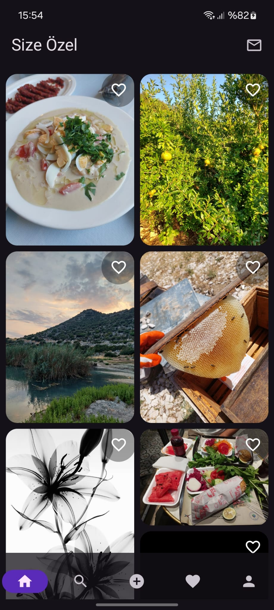
  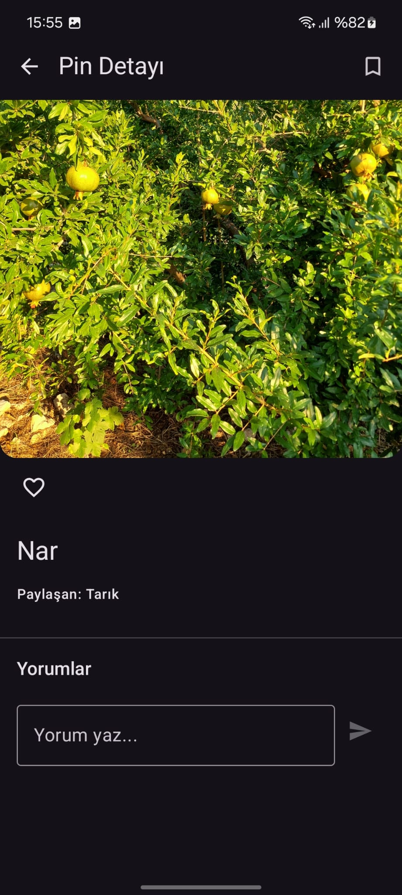
  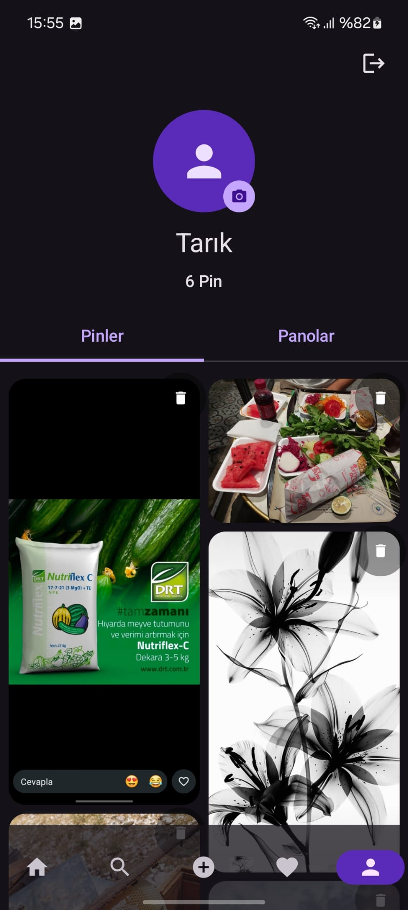
</div>

<br>

<!-- Kalan görseller açılır-kapanır menüde -->
<details>
  <summary><b>👉 Uygulamanın Diğer Ekranlarını İncelemek İçin Tıklayın</b></summary>
  <br>
  <div align="center">
    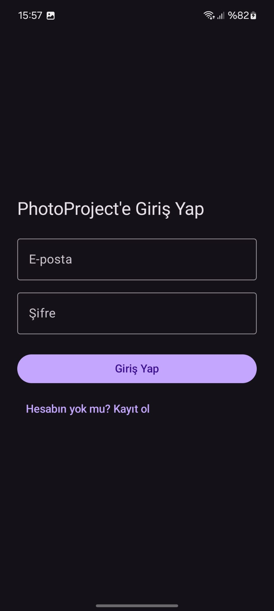
    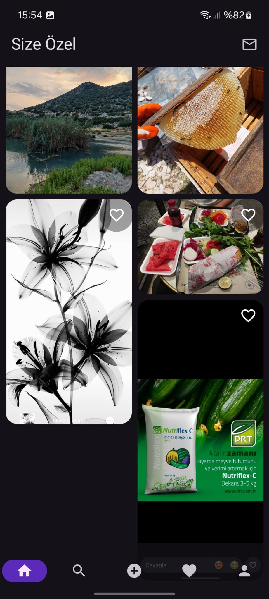
    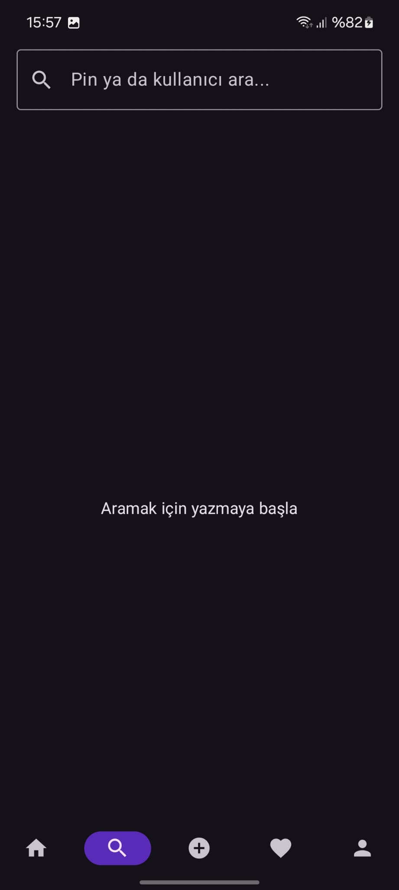
    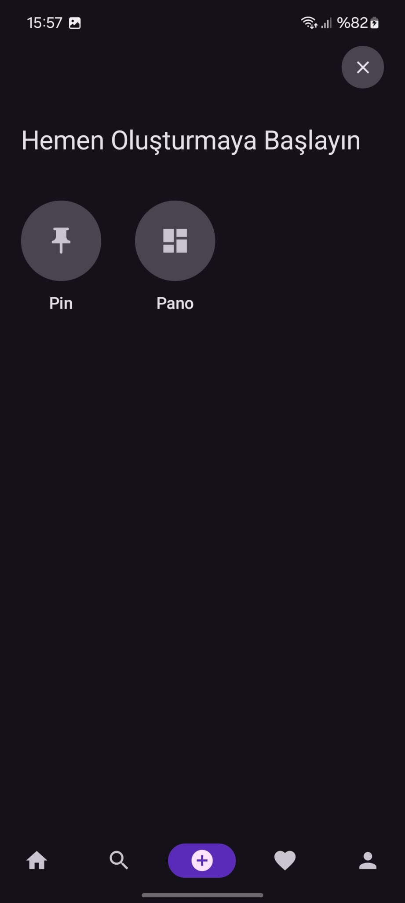
    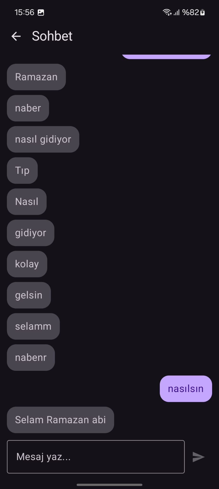
    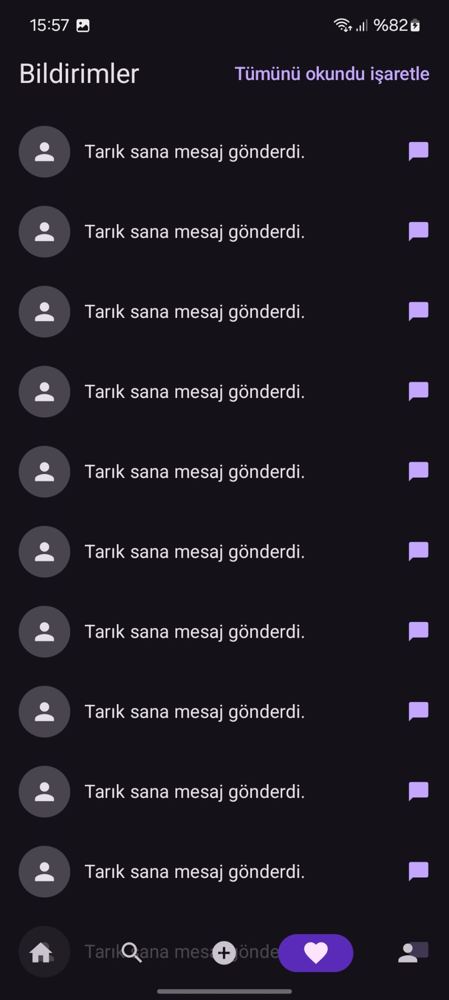
    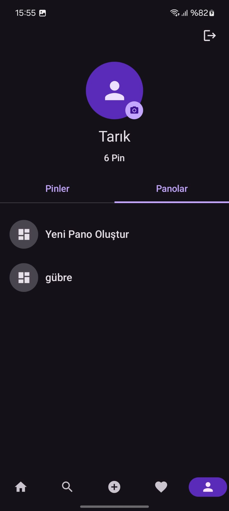
    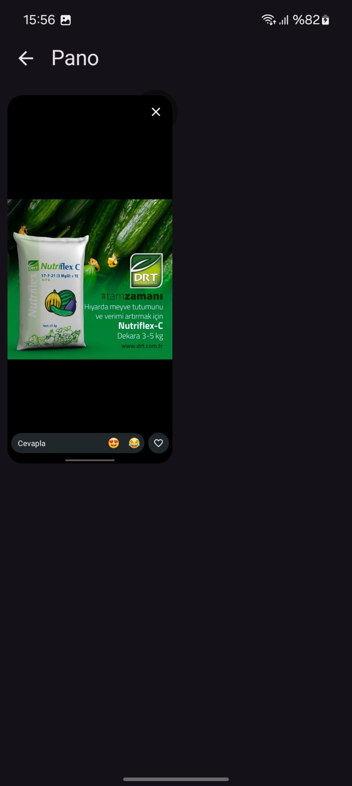
    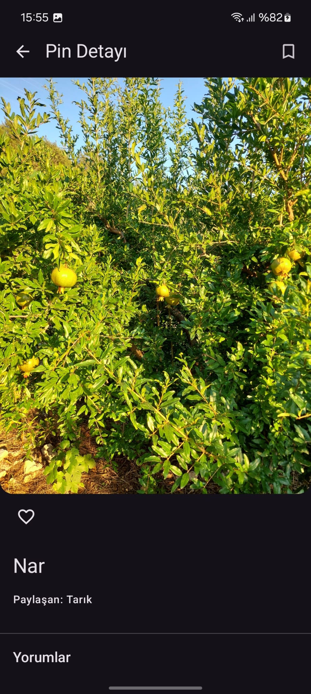
    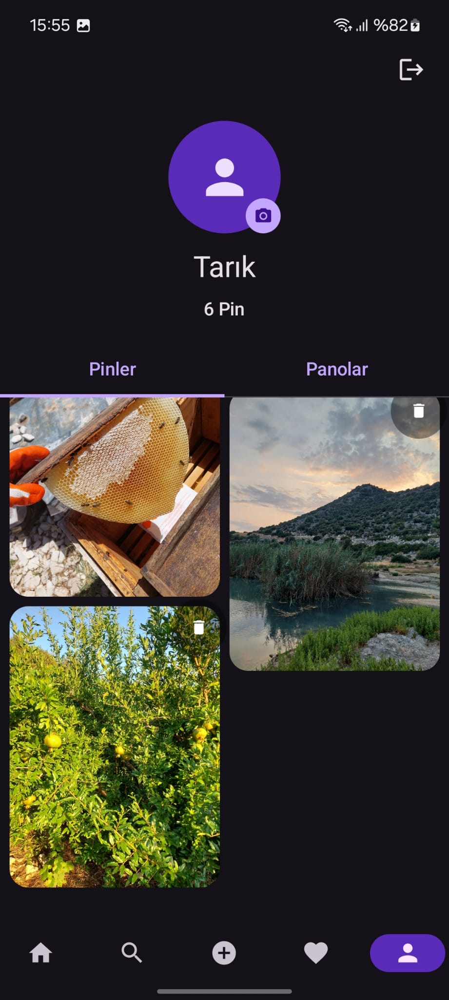
  </div>
</details>

## 🚀 Kurulum

### Gereksinimler
- Android Studio (güncel sürüm)
- JDK 17
- Docker Desktop (backend için)

### Backend'i Çalıştırma

```bash
git clone https://github.com/KULLANICI_ADIN/photoproject-backend.git
cd photoproject-backend
cp .env.example .env   # kendi değerlerinizi girin (DB, JWT, Cloudinary)
docker-compose up -d --build
```

### Mobil Uygulamayı Çalıştırma

```bash
git clone https://github.com/KULLANICI_ADIN/photoproject-android.git
```

1. Android Studio'da projeyi açın.
2. `NetworkModule.kt` içindeki `BASE_URL` değerini kendi backend adresinize göre güncelleyin (emülatörde `http://10.0.2.2:8085`, gerçek cihazda yerel ağ IP'niz).
3. Gradle senkronizasyonunun tamamlanmasını bekleyin.
4. Uygulamayı çalıştırın.

## 📌 Öne Çıkan Mühendislik Kararları

- **N+1 sorgu problemi önleme** — Beğeni/kaydetme durumları, her pin için ayrı sorgu yerine tek bir toplu sorgu ile hesaplanır.
- **Debounce'lu arama** — Kullanıcı yazarken gereksiz network isteklerini önlemek için 400ms gecikmeli, iptal edilebilir arama.
- **Process death güvenliği** — Navigation argümanları `SavedStateHandle` üzerinden yönetilir, uygulama arka planda sonlandırılsa bile durum kaybolmaz.
- **Edge-to-edge tasarım** — Sistem çubukları ile çakışmayan, glassmorphism etkili alt navigasyon çubuğu.
- **Görsel sıkıştırma** — Yüklenen fotoğraflar, ağ kullanımını ve sunucu yükünü azaltmak için istemci tarafında otomatik olarak yeniden boyutlandırılır.

## 👤 Geliştirici

**Zeki Tarık Türkdil**
[GitHub](https://github.com/ZekiTarik) · [LinkedIn](https://linkedin.com/in/zekitarikturkdil)
